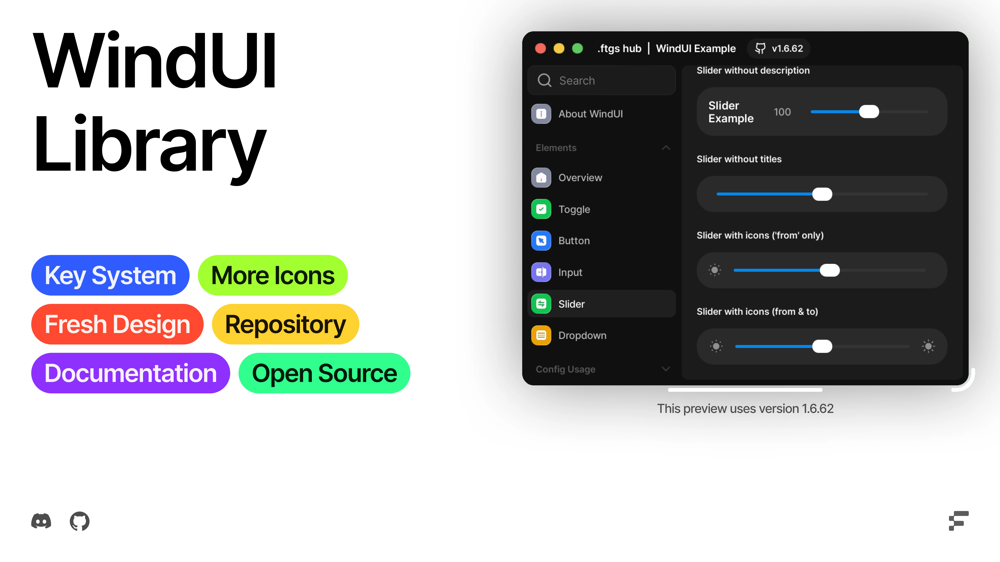

<!--<h1 align="center">WindUI</h1> -->

<!--
<picture>
    <source srcset="docs/banner-dark.webp" media="(prefers-color-scheme: dark)">
    <source srcset="docs/banner-light.webp" media="(prefers-color-scheme: light)">
    
</picture>-->


[](https://uibin.orqan.xyz/library/341a345c-b3c9-42fe-a45c-eb296580ce61)

> [!WARNING]
> This WindUI was not inspired by, and the name has nothing to do with UI Frameworks

> [!WARNING]
> WindUI is currently in Beta.
> This project is still under active development. Bugs, issues, and unstable features may occur. We're constantly working on improvements, so please be patient and report any problems you encounter.

## What is WindUI?

WindUI is a Luau UI library for building windows, tabs, sections and interactive elements (buttons, toggles, sliders, dropdowns, keybinds, color pickers, and more) with theming, acrylic/blur backgrounds, and a built-in key-system component out of the box.

## Features

- 20+ ready elements: `Button`, `Toggle`, `Slider`, `Dropdown`, `Input`, `Keybind`, `Colorpicker`, `ProgressBar`, `Code`, `Paragraph`, `Video`, `Viewport`, layout helpers (`HStack`, `VStack`, `Group`, `Space`, `Divider`) and more
- A theme engine with 15+ built-in themes (`Dark`, `Light`, `Rose`, `Plant`, `Sky`, `Amber`, `Rainbow`, `Premium`, ...) and full support for custom ones
- **Animated gradients** — any theme color can be a moving `UIGradient` (see [Themes](#themes) below) driven by a single shared render loop, not a tween per element
- Acrylic / blur window backgrounds (`src/utils/Acrylic`)
- Built-in key-system UI with pluggable backends (Luarmor, Platoboost, Panda Development, Junkie Development)
- Localization support and a Lucide-based icon set (`src/Icons`)
- Config saving/loading and theme persistence

## Installation

```luau
local WindUI = loadstring(game:HttpGet("https://github.com/Footagesus/WindUI/releases/download/latest/main.lua"))()
```

Or read the full guide: [Installation Docs](https://footagesus.github.io/WindUI-Docs/docs/installation)

For local development, require the source directly:

```luau
local WindUI = require("./src/Init")
```

## Quick example

```luau
local WindUI = loadstring(game:HttpGet("https://github.com/Footagesus/WindUI/releases/download/latest/main.lua"))()

local Window = WindUI:CreateWindow({
    Title = "My Hub",
    Icon = "rbxassetid://0",
    Author = "you",
    Folder = "MyHub",
    Size = UDim2.fromOffset(580, 460),
    Theme = "Premium",
    Resizable = true,
})

local Tab = Window:Tab({ Title = "Main", Icon = "home" })

Tab:Button({
    Title = "Say hi",
    Callback = function()
        WindUI:Notify({ Title = "Hey!", Content = "Button pressed.", Duration = 3 })
    end,
})

Tab:Toggle({
    Title = "Auto Farm",
    Default = false,
    Callback = function(state) end,
})
```

Full runnable example: [`main_example.lua`](/main_example.lua)

```luau
loadstring(game:HttpGet('https://raw.githubusercontent.com/Footagesus/WindUI/refs/heads/main/main_example.lua'))()
```

## Themes

Switch theme at any time:

```luau
WindUI:SetTheme("Premium")
```

| Theme | Notes |
|---|---|
| `Dark` / `Light` | Default neutral themes |
| `Rose`, `Plant`, `Red`, `Indigo`, `Sky`, `Violet`, `Emerald`, `Midnight`, `Crimson` | Flat accent-color themes |
| `Amber`, `Rainbow` | Built-in gradient themes |
| `MonokaiPro`, `CottonCandy`, `Mellowsi` | Community-submitted themes |
| **`Premium`** | Black background with a **moving gold ↔ violet gradient** across the accent, buttons, toggle and checkbox surfaces |

### Building a custom animated gradient

Any theme color returned by `WindUI:Gradient(stops, props)` can rotate on its own instead of sitting static — pass `Animated = true` and an optional `AnimationSpeed` (degrees per second, default `40`) in `props`:

```luau
MyTheme.Accent = WindUI:Gradient({
    ["0"]   = { Color = Color3.fromHex("#f7d774"), Transparency = 0 },
    ["50"]  = { Color = Color3.fromHex("#7b4de0"), Transparency = 0 },
    ["100"] = { Color = Color3.fromHex("#f7d774"), Transparency = 0 },
}, { Rotation = 0, Animated = true, AnimationSpeed = 35 })
```

Internally this registers the resulting `UIGradient` on a single shared `RunService.Heartbeat` connection (`Creator.StartGradientAnimationLoop`) that advances `Rotation` for every animated gradient currently on screen — so adding more animated elements doesn't add more connections.

## Credits

#### Icons (https://github.com/Footagesus/Icons)

- [Lucide-Icons](https://github.com/lucide-icons/lucide)
- [Craft Icons](https://www.figma.com/community/file/1415718327120418204)
- [Geist Icons](https://vercel.com/geist/icons)
- [Solar Icons](https://icones.js.org/collection/solar)
- [SF Symbols](https://sf-symbols-one.vercel.app/)

### Links

- [Discord Server](https://discord.gg/ftgs-development-hub-1300692552005189632)
- [Documentation](https://footagesus.github.io/treehub-web/docs/windui)
- [Installation](https://footagesus.github.io/WindUI-Docs/docs/installation)
- [Example](/main_example.lua) (wip)
    ```luau
    loadstring(game:HttpGet('https://raw.githubusercontent.com/Footagesus/WindUI/refs/heads/main/main_example.lua'))()
    ```
